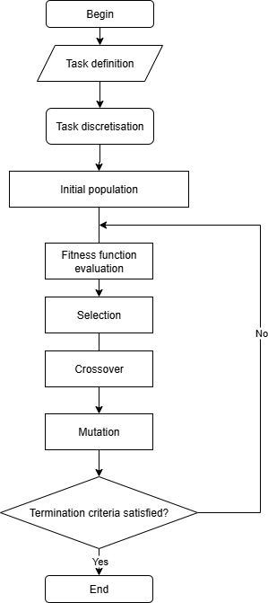

# Earth Observation Satellite Task Scheduler  
## Genetic Algorithm Optimization for LEO Mission Planning  

[](https://opensource.org/licenses/MIT)
[](https://www.python.org/downloads/) \

 

 


## Overview  



This is a **demo prototype** I built in about **4–5 days** to test how **genetic algorithms** could handle scheduling tasks for Low Earth Orbit (LEO) Earth observation satellites.  

It’s not a full mission planner yet, but the results show that GAs can optimize resources (power, storage, comms, imaging windows) and handle complex constraints better than simple heuristics.  

-> I’m aiming to develop this further as part of my **Master’s thesis**. If you’re a researcher, professor, or industry partner interested in this area, I’d love to connect.  

## Usage
Using this library is as easy as defining the ground targets
```python
rome = Target(n_of_requested_observations=7, 
                        name='rome',
                        rewards=[0,5,10,15,20,25,30,35])
paris = Target(n_of_requested_observations=4, 
                    name='paris',
                    rewards=[0,1,2,3,4])
```  
and the observer(s)
```python
candidate_tasks = TasksBuilder.build_candidate_tasks(tasks, dt=5, sorted_by='start_time')

orbit = Orbit(candidate_tasks=candidate_tasks)

satellite = Satellite(
    orbits=[orbit, ]
)

opt = Optimizer(
    satellites=[satellite,]
)
```  
An example output would be someting like
```bash
fitness: 361
sol_idx: 2
time: 1.171875 s
==============================
target: paris; start: 0 s; end: 20 s
target: paris; start: 20 s; end: 40 s
target: paris; start: 60 s; end: 80 s
target: paris; start: 280 s; end: 300 s
target: rome; start: 455 s; end: 480 s
target: rome; start: 480 s; end: 505 s
target: rome; start: 520 s; end: 545 s
target: rome; start: 555 s; end: 580 s
target: rome; start: 580 s; end: 605 s
target: rome; start: 605 s; end: 630 s
target: rome; start: 640 s; end: 665 s
``` 

## Features  

### Current (works today)  
- Core **genetic algorithm**: selection, crossover, mutation  
- Multi-constraint optimization (power, storage, comms)  
- Task prioritization with weighted objectives  
- Automatic conflict resolution  
- Performance plots + evolution tracking  

### Roadmap (what’s next)  
- Orbital mechanics (Skyfield / Astropy)  
- Target visibility from TLEs  
- Full resource models (power budget, thermal, storage)  
- Multi-satellite constellation scheduling  
- Real-time rescheduling + anomaly handling  
- GUI for mission planning  


## Results (Prototype)  

- **Efficiency**: 40–60% better than simple heuristics  
- **Feasibility**: >95% valid schedules after evolution  
- **Convergence**: ~100–500 generations depending on scenario  

To test on use cases like:  
- Urban monitoring  
- Disaster response  
- Agricultural surveys  

## Installation  

```bash
# Clone the repo
git clone https://github.com/lucaoflaif/SATOptimizer.git
cd SATOptimizer

# Setup environment
conda create --name <env> --file requirements.txt
conda activate <env>
```  


## Project Structure  

```
SATOptimizer/
├── main.py                 # entry point
├── models/                 # data models for:
│   ├── __init__.py         
│   ├── optimizer.py         # pyGAD wrapper
│   ├── orbit.py             # orbits
│   ├── satellite.py         # satellites
│   ├── target.py            # targets
│   ├── task.py              # tasks and tasks candidates
│   └── taskbuilder.py       # utils for task discretization
├── docs/                   # further on this project
└── requirements.txt        # file for conda env building
```  


## Thesis & Collaboration  

This is a **prototype** → built quickly, but with room to grow into a full research project.  
I’m looking for:  
- **Thesis supervision** (Aerospace / Optimization / AI)  
- **Industry collaboration** (real data, mission scenarios)  
- **Research mentorship**  


## Contact  

**Name**: Luca Di Vita \
**Program**: MSc Aerospace Engineering (Final Year) \
**Email**: luca.divita@studenti.polito.it


## License  

MIT License (see [LICENSE](LICENSE))  

---

For a deeper dive into the research background and future directions, check out [docs/RESEARCH.md](docs/RESEARCH.md).  
